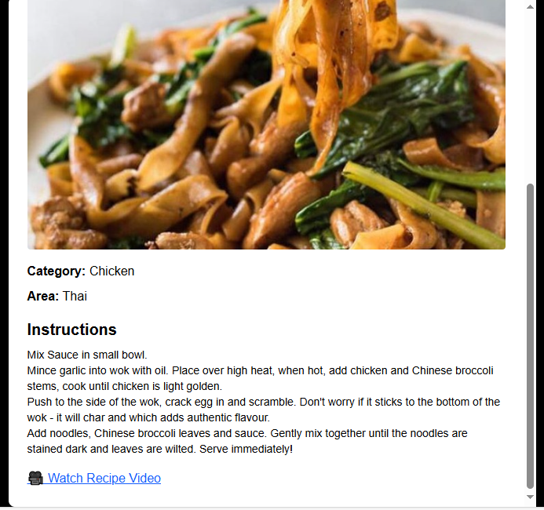

# 🍴 Recipe Finder

A clean and responsive web app to discover recipes by ingredients.
Built with React + Vite, styled using Tailwind CSS, and powered by the TheMealDB API.

## 🔗 Live Demo

🌐 App: https://codesandbox.io/p/github/MohammedAbdulFarhan08/recipe-finder/main

## ✨ Features

Search recipes by ingredient (e.g., chicken, egg, tomato).
Responsive card grid layout with images.
Detailed recipe view (category, origin, instructions, video).
Mobile-friendly and error-handled.

## 🖼️ Screenshots
### 🔍 Hero Section + Search

### 🥗 Recipe Grid

### 📖 Recipe Modal

## 🛠️ Tech Stack

React + Vite (frontend)
Tailwind CSS (styling)
TheMealDB API (data)

## 🚀 Quick Start

git clone https://github.com/MohammedAbdulFarhan08/recipe-finder.git
cd recipe-finder
npm install
npm run dev

## 📦 Deployment

Easily deployed on CodeSandbox, StackBlitz.

## 👨‍💻 Author

Developed by Mohammed Abdul Farhan as part of a UI Take-Home Challenge.